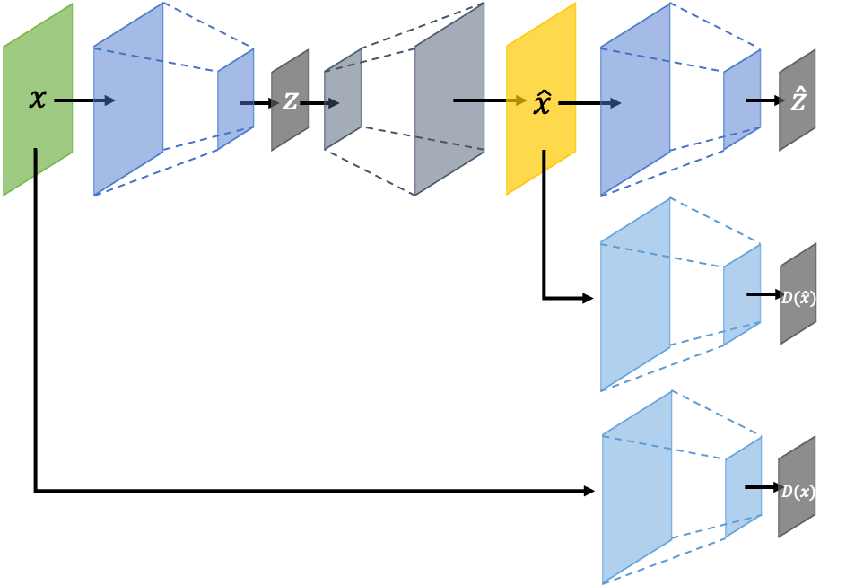
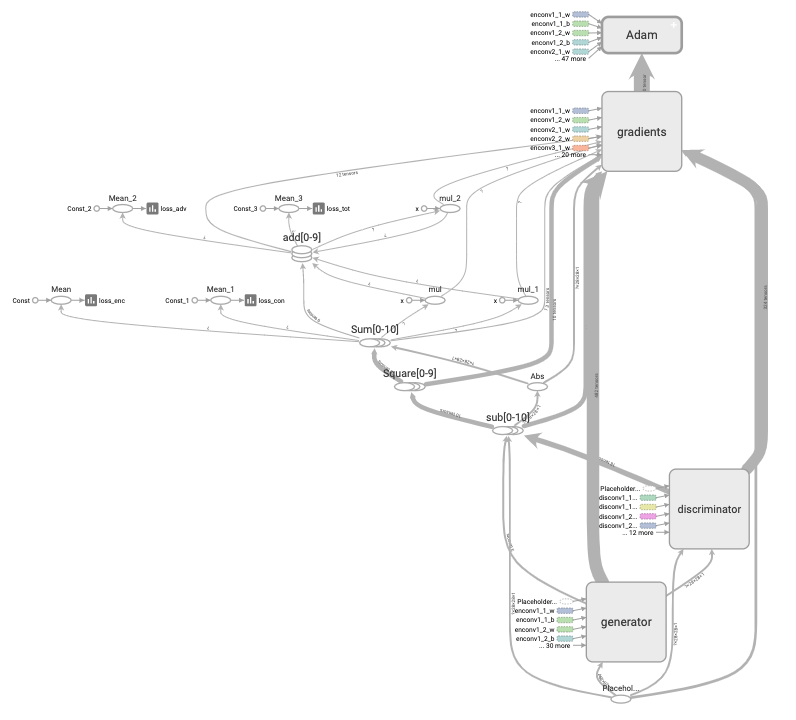
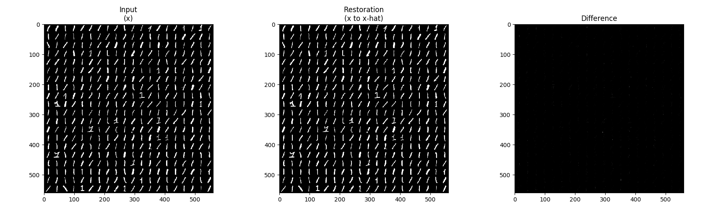
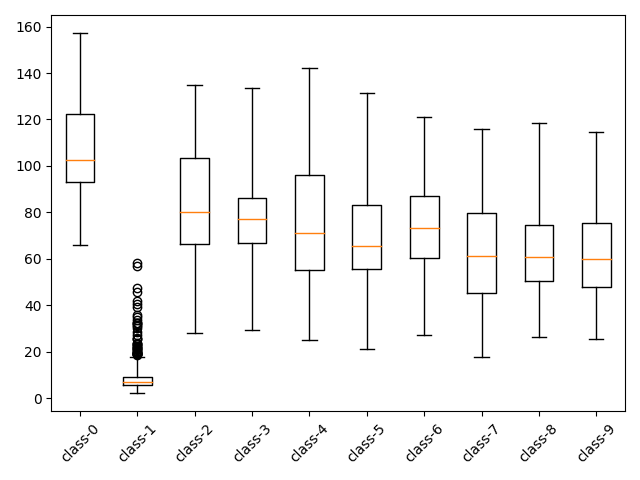

GANomaly
=====

Implementation of GANomaly with MNIST dataset [<a href="https://github.com/YeongHyeon/CVAE-AnomalyDetection">Related repository</a>].

## Architecture

    
  
Simplified GANomaly architecture.

## Graph in TensorBoard

    
  
Graph of GANomaly.

## Problem Definition

    
  
'Class-1' is defined as normal and the others are defined as abnormal.

## Results

    
  
Restoration result by GANomaly.

  
  
Box plot with encoding loss of test procedure.

## Environment
* Python 3.7.4  
* Tensorflow 1.14.0  
* Numpy 1.17.1  
* Matplotlib 3.1.1  
* Scikit Learn (sklearn) 0.21.3  

## Reference
[1] S Akcay, et al. (2018). <a href="https://arxiv.org/abs/1805.06725">Ganomaly: Semi-supervised anomaly detection via adversarial training.</a>. arXiv preprint arXiv:1805.06725.
